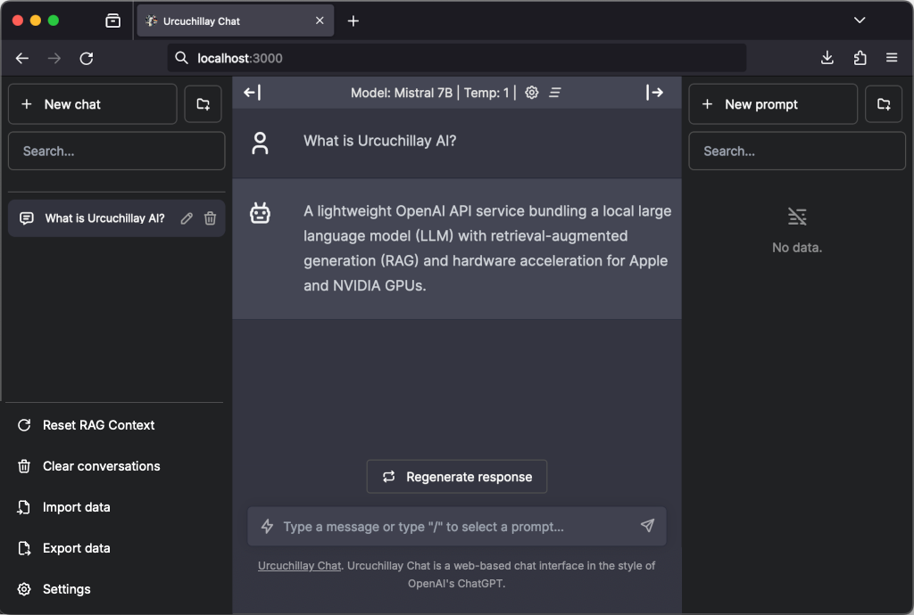
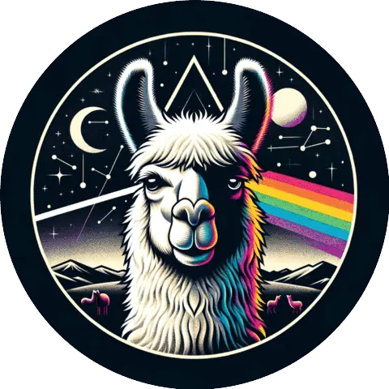

# [Urcuchillay Chat](http://chat.urcuchillay.ai)

"Ur-koo-CHEE-lye"

## Your friendly, local AI chat interface

Urcuchillay Chat is a web-based chat interface for [Urcuchillay AI](http://urcuchillay.ai) in the style of OpenAI's ChatGPT, based on [Chatbot UI](https://github.com/mckaywrigley/chatbot-ui).



<div style="text-align:center;">
  
</div>

In the Incan religion, Urcuchillay was depicted as a multicolored male llama, worshipped by Incan herders for his role in protecting and increasing the size of their herds.

## Quickstart Guide
*Note*: In the following examples Urcuchillay AI's [gateway](https://github.com/castellotti/urcuchillay#gateway) service is running on port ```8080```
### Docker

#### Build and run locally ####
```shell
docker build -t urcuchillay-chat .
docker run \
    --add-host=host.docker.internal:host-gateway \
    -e OPENAI_API_HOST=http://host.docker.internal:8080 \
    -e OPENAI_API_KEY=xxxxxxxx \
    -p 3000:3000 \
    urcuchillay-chat
```

#### Pull from ghcr ####
```shell
docker run \
    --add-host=host.docker.internal:host-gateway \
    -e OPENAI_API_HOST=http://host.docker.internal:8080 \
    -e OPENAI_API_KEY=xxxxxxxx \
    -p 3000:3000 \
    ghcr.io/castellotti/urcuchillay-chat:main
```

### Local

1. Clone repository

```shell
git clone https://github.com/castellotti/urcuchillay-chat.git
```

2. Install dependencies

```shell
npm i
```

3. *Optional*: Provide OpenAI API Key in configuration file

Create a .env.local file in the root of the repo with your OpenAI API Key (or use "xxxxxxxx" for Urcuchillay AI):

```shell
OPENAI_API_KEY=YOUR_KEY
```

4. Run App

```shell
npm run dev
```

5. Open Web Chat UI in a browser:
- [http://localhost:3000](http://localhost:3000)
